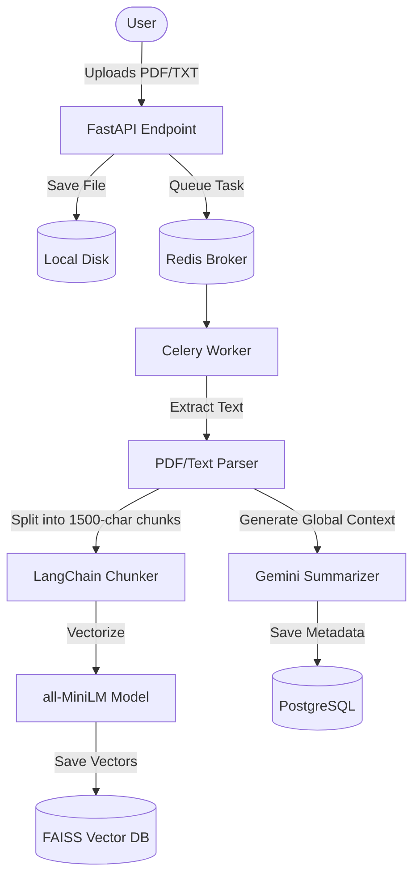
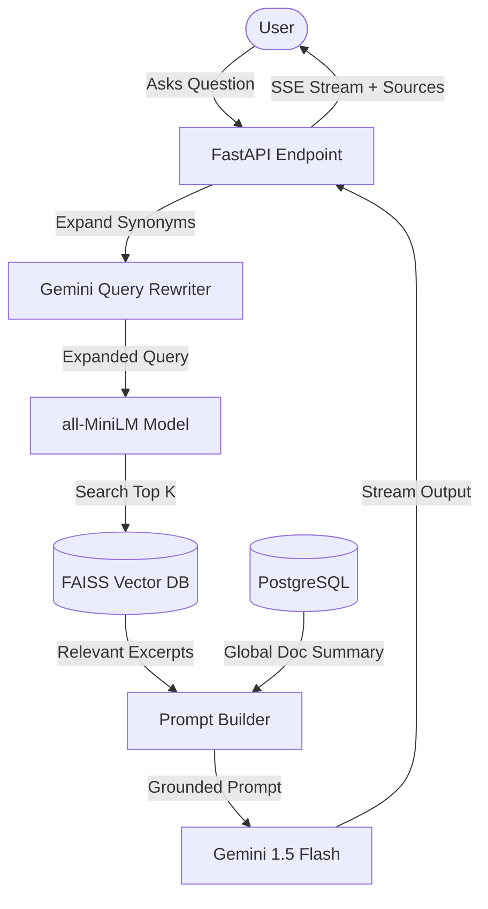

# AskDoc: Intelligent RAG Document Q&A 🧠📄

Ever wished you could just *talk* to your documents? AskDoc makes that a reality. 

Instead of mindlessly scrolling through hundreds of pages of PDFs or text files to find one specific detail, you can simply upload your documents and ask questions in plain English. AskDoc reads, understands, and remembers everything, giving you precise answers backed by exact source citations. 

It's like having your own Mike Ross who instantly memorizes every document you give them!

---

## 📸 Screenshots

*(Hey there! Please take the following screenshots and add them here to make the README pop:)*
1. **The Chat Interface**: Showing a question and the AI's response with source citations.
2. **The Document Sidebar**: Showing the list of uploaded documents and the "Upload" state.
3. **The Auth Gate**: Showing the sleek "Unique Identifier" screen.

---

## 🛠️ The Technical Deep Dive: What, How, and Why

AskDoc is built on the **Retrieval-Augmented Generation (RAG)** architecture. LLMs are smart, but they hallucinate when they don't know the facts. RAG solves this by securely searching your personal documents and injecting the relevant facts directly into the LLM's brain just before it answers.

Here is a look at the technical decisions we made to make this fast, secure, and production-ready:

### 1. The Brains (LLM & Embeddings)
- **Generation & Rewriting:** We use **Google Gemini 1.5 Flash**. It's incredibly fast, highly capable, and has a massive context window. We use it for three things: generating the final answer, summarizing documents globally, and rewriting user queries to include synonyms for better search results.
- **Embeddings:** We use a local, open-source model (`all-MiniLM-L6-v2`) via `SentenceTransformers`. **Why?** It's free, runs instantly on CPU, and ensures your private document vectors never leave your server.

### 2. The Memory (Vector & Relational Databases)
- **Vector Search (FAISS):** We use Facebook's AI Similarity Search (FAISS). We opted for an `IndexFlatIP` (cosine similarity) stored on disk. **Why?** It's blazing fast, has zero network overhead compared to cloud vector databases, and handles our scale perfectly. We implemented a custom "rebuild" strategy for document deletions to prevent metadata corruption, and thread-safe locking for concurrent access.
- **Relational Data (PostgreSQL):** Handles document metadata, statuses, chunk mapping, and query logging.

### 3. The Muscles (Async Processing & API)
- **Backend (FastAPI):** Python's fastest modern web framework. It natively supports async/await, making it perfect for streaming LLM responses via Server-Sent Events (SSE).
- **Task Queue (Celery + Redis):** Document ingestion (parsing, chunking, embedding) is extremely CPU-heavy. **Why?** If we did this in the FastAPI request cycle, the server would hang. Celery offloads this to background workers, keeping the API lightning fast.

### 4. The Face (Frontend)
- **React + TanStack (Vite):** A heavily optimized Single Page Application. 
- **Security First:** We removed the API key from the JavaScript bundle. Instead, we use a sleek runtime `AuthGate` that prompts the user for their key, storing it only in session memory. 

---

## 🏗️ Architecture Diagrams

### 1. The Ingestion Pipeline
When you upload a document, we don't just save it. We break it down, understand it globally, and embed it for semantic search.



### 2. The Query Pipeline
When you ask a question, we dynamically rewrite it, find the most relevant chunks, and build a grounded prompt for the LLM.



---

## 🚀 Getting Started

Ready to spin it up? You'll need 4 terminal tabs.

### 1. Start Infrastructure (Postgres & Redis)
```bash
cd backend
docker compose up -d
```

### 2. Start the Backend API
Make sure you copy `backend/.env.example` to `backend/.env` and add your `GEMINI_API_KEY`!
```bash
cd backend
python -m venv .venv && source .venv/bin/activate
pip install -r requirements.txt
uvicorn api.main:app --reload --port 8000
```

### 3. Start the Background Worker
```bash
cd backend
source .venv/bin/activate
celery -A ingestion.tasks worker --loglevel=info
```

### 4. Start the Frontend
```bash
cd frontend
npm install
npm run dev
```

Open `http://localhost:5173` in your browser. You will be prompted to enter the `API_KEY` you defined in your backend `.env` file.
